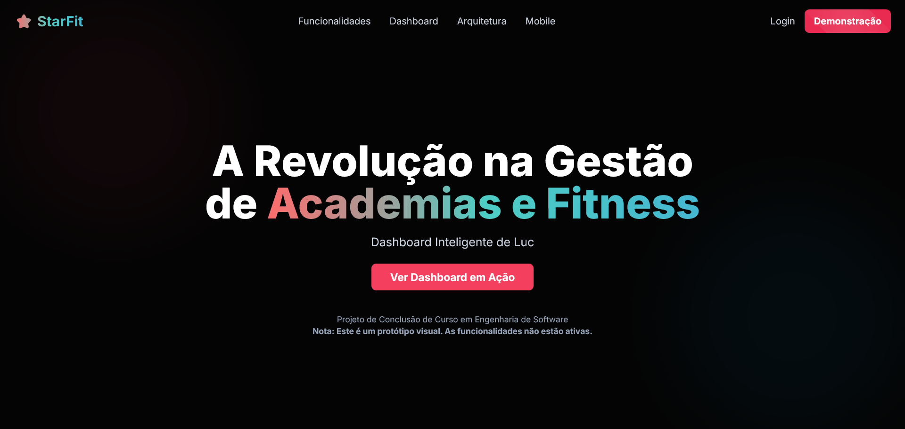
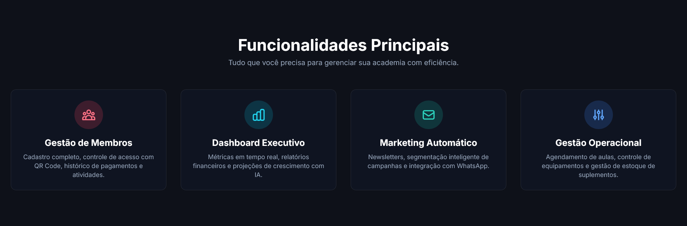
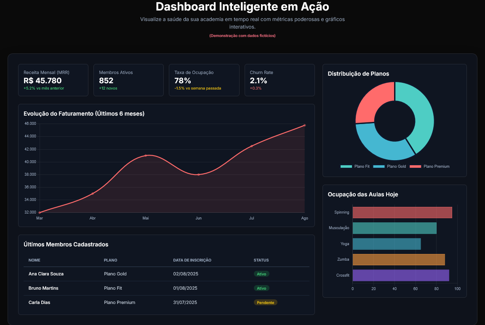
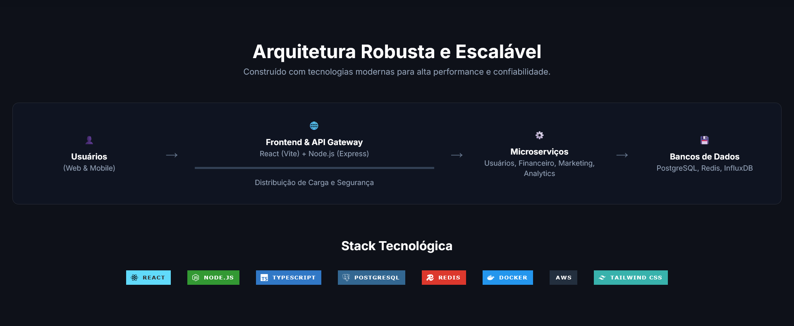
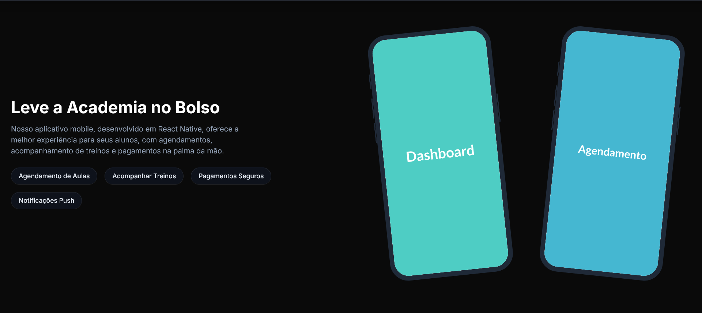
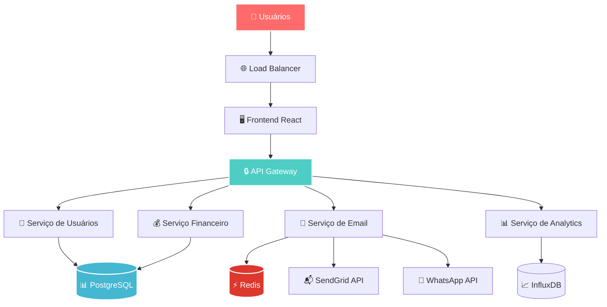

# ⭐ StarFit

<div align="center">
  
</div>

<div align="center">
  <br>
  
  
  
  
  
</div>

---

## 📋 Sobre o Projeto

O **StarFit** é um protótipo conceitual de uma plataforma SaaS para gerenciamento de academias, desenvolvido no âmbito da disciplina de **Análise e Projeto de Sistemas** do curso de Ciência da Computação da **Universidade Cruzeiro do Sul**.

O objetivo principal do projeto foi aplicar os conhecimentos teóricos de engenharia de software em um cenário prático, abrangendo desde a modelagem de requisitos e arquitetura de sistemas até o desenvolvimento de um protótipo de interface de alta fidelidade. Este repositório contém o "blueprint" do sistema, ou seja, toda a sua documentação e planejamento.

É importante ressaltar que o website navegável contido aqui serve como uma **visualização do conceito planejado**. Ele não representa o estado final do projeto nem seu estágio de desenvolvimento atual, mas sim uma demonstração tangível da visão e das funcionalidades idealizadas durante a fase de análise.

---

## 🎬 Protótipo em Ação

A seguir, uma visão geral das principais seções do protótipo navegável, demonstrando a interface e a experiência do usuário planejadas.

<div align="center">
  <em>Tela Inicial - Apresentação do conceito e proposta de valor.</em>
  <br><br>
  
</div>

---

<div align="center">
  <em>Seção de Funcionalidades - Detalhamento dos principais recursos da plataforma.</em>
  <br><br>
  
</div>

---

<div align="center">
  <em>Dashboard Executivo - Exibição de métricas e gráficos interativos para gestão.</em>
  <br><br>
  
</div>

---

<div align="center">
  <em>Arquitetura do Sistema - Demonstração visual da arquitetura planejada.</em>
  <br><br>
  
</div>

---

<div align="center">
  <em>App Mobile - Protótipo da experiência do aluno na palma da mão.</em>
  <br><br>
  
</div>

---


## ✨ Funcionalidades Representadas no Protótipo

A interface simula as seguintes funcionalidades-chave, planejadas para a versão completa do sistema:

<table>
<tr>
<td width="50%">

### 👥 Gestão de Membros
- **Cadastro completo** de alunos e funcionários
- **Sistema de mensalidades** com cobrança automática
- **Controle de acesso** com QR Code e biometria
- **Histórico detalhado** de atividades e pagamentos

### 📊 Dashboard Executivo
- **Métricas em tempo real** de faturamento e ocupação
- **Relatórios financeiros** personalizáveis
- **Análise de performance** por unidade
- **Projeções de crescimento** com IA

</td>
<td width="50%">

### 💌 Marketing Automático
- **Newsletter automatizada** com templates responsivos
- **Segmentação inteligente** de campanhas
- **Integração com WhatsApp** Business API
- **Análise de engajamento** e conversão

### 🏋️ Gestão Operacional
- **Agendamento de aulas** e personal trainers
- **Controle de equipamentos** e manutenção
- **Gestão de estoque** de suplementos
- **Arquitetura Multi-tenant** para várias academias

</td>
</tr>
</table>

---

## 🔄 Arquitetura Conceitual do Sistema

O diagrama abaixo representa a arquitetura de microserviços planejada para o StarFit, que guiou o design do protótipo e a definição das funcionalidades.



---

## ⚡ Visualizando o Protótipo

Este repositório contém apenas o protótipo frontend. Para executá-lo localmente, siga os passos abaixo.

### Pré-requisitos
- **Node.js 18+**
- **npm** ou **Yarn**

### Instalação

```bash
# 1. Clone o repositório
git clone [https://github.com/Ansbach-0/StarFit.git](https://github.com/Ansbach-0/StarFit.git)
cd StarFit

# 2. Instale as dependências do frontend
npm install

# 3. Execute o servidor de desenvolvimento
npm run dev

# 4. Abra o navegador em http://localhost:5173 (ou na porta indicada)
```
**Atenção:** Como este é um protótipo visual, as funcionalidades de backend, como login e salvamento de dados, não estão implementadas.

---

## 🏗️ Estrutura do Protótipo

O código-fonte do protótipo está organizado da seguinte forma:

```
📁 StarFit/
├── 📁 public/                 # Assets estáticos
├── 📁 src/
│   ├── 📁 components/          # Componentes React reutilizáveis
│   ├── 📁 pages/              # Páginas da aplicação (simuladas)
│   ├── 📁 styles/             # Estilos globais e temas
│   ├── 📁 hooks/              # Custom hooks
│   ├── App.tsx               # Componente principal
│   └── main.tsx              # Ponto de entrada da aplicação
├── 📄 index.html
├── 📋 package.json
├── ⚙️ vite.config.ts
├── ⚙️ tsconfig.json
└── 📋 README.md
```

---

## 👨‍🎓 Equipe de Desenvolvimento

Este projeto foi concebido e desenvolvido por uma equipe de estudantes de Ciência da Computação da Universidade Cruzeiro do Sul.

| Membro | Responsabilidade Principal |
| :--- | :--- |
| **Vinicius Ansbach** | **Arquiteto de Backend:** Definição da arquitetura de microserviços, modelagem do banco de dados (PostgreSQL) e design dos contratos de API. |
| **André Felipe Jorge Rachid** | **Líder de Frontend:** Desenvolvimento da estrutura principal em React, gerenciamento de estado e implementação da lógica dos componentes. |
| **Vitor Stratikopoulos França** | **UI/UX Designer e Desenvolvedor Frontend:** Criação da identidade visual, design da experiência do usuário e implementação dos estilos com Tailwind CSS. |
| **Flavio Caramit** | **Engenheiro de DevOps e Infraestrutura:** Planejamento da containerização com Docker e da esteira de CI/CD com GitHub Actions. |
| **Guilherme Souza** | **Analista de Negócios e API Designer:** Mapeamento das regras de negócio, detalhamento das funcionalidades e especificação dos endpoints da API. |

---

## 🤝 Contribuições

Sendo um projeto acadêmico com escopo definido, não estamos buscando contribuições externas ativamente. No entanto, sinta-se à vontade para fazer um *fork* do projeto, explorar o código e nos contatar com sugestões ou dúvidas.

---

## 📄 Licença

Distribuído sob a **Licença MIT**. Veja o arquivo `LICENSE` para mais informações.

```
MIT License
Copyright (c) 2024 Vinicius Ansbach, André Felipe Jorge Rachid, Vitor Stratikopoulos França, Flavio Caramit, Guilherme Souza
```

---

<div align="center">
  
  <br>
  <strong>⭐ Um projeto acadêmico construído com dedicação e foco no aprendizado. ⭐</strong>
  <br>
</div>
